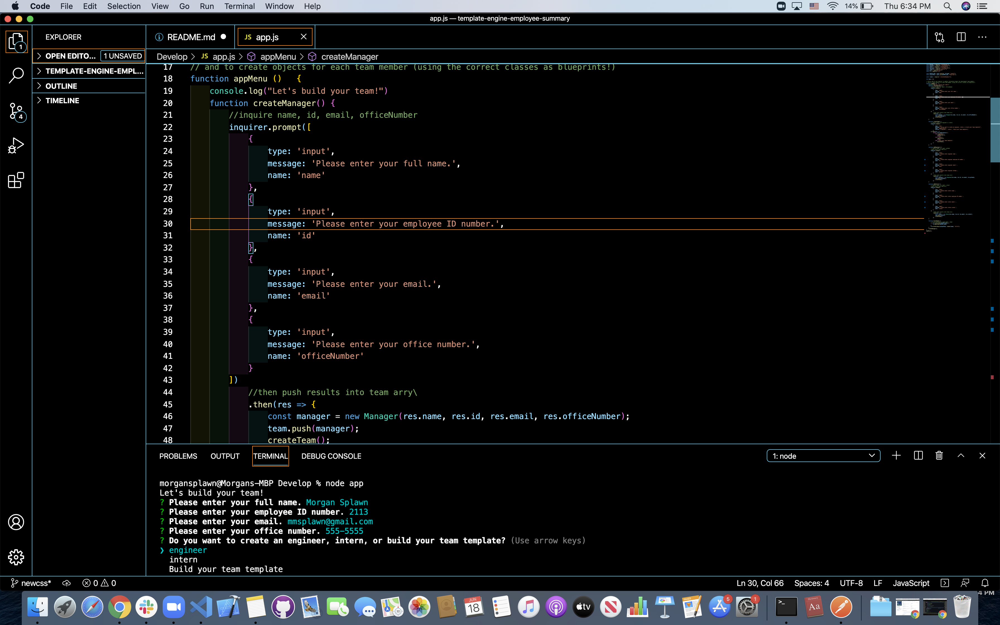
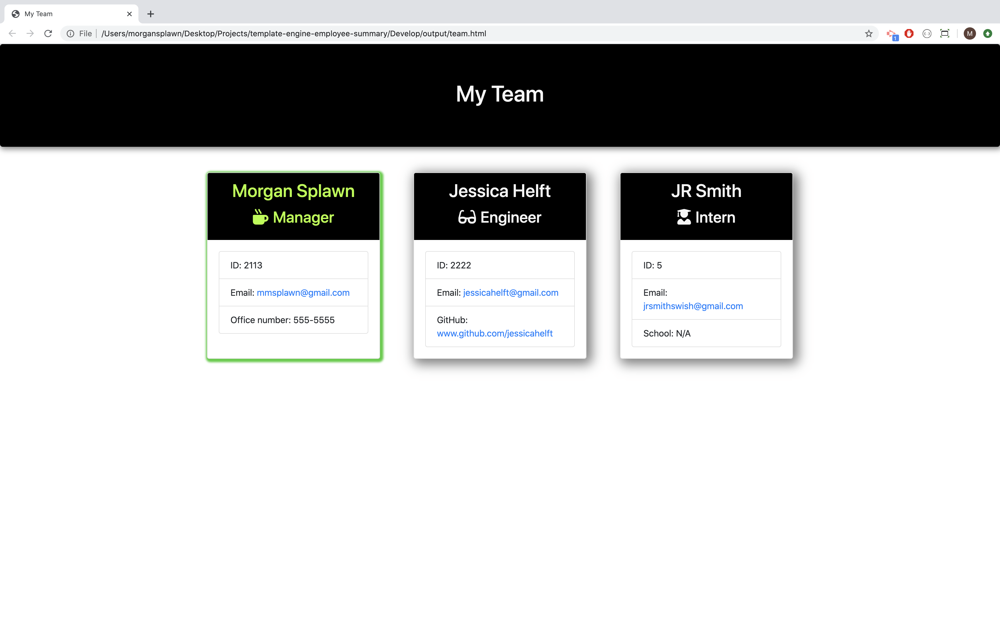

# Template Engine

# **Project Description**
For this project I modified existing code to create a CLI driven application that prompts a manager to create cards for all relevant team members and display them in a relevant way. Managers can create a team via the required classes the build their team and render it to an HTML file. All classes are required to pass tests to validate them.

# **Screencaps:**

# **Demo Video:**
[https://drive.google.com/file/d/1Rp3A5gqIXETpRQcXIrvwFpsWsMaiew4w/view]

# **Installation and Use**
Download the zip file and unzip it. Open the files and run npm install to intall the required dependencies. Then run node app and answer the prompted questions. Upon completion check the output folder to view the team.html file in your browser.

# **Technology Stack**
* HTML 
* CSS
* Javascript
* Bootstrap
* Node
* Inquirer
* Jest

# **Contact**
* ### **Name:**  Morgan Splawn @msplawn
* ### **Email:**  [mmsplawn@gmail.com](msplawn@gmail.com)
* ### **LinkedIn:**  [https://www.linkedin.com/in/morgan-splawn-72979a1a9/](https://www.linkedin.com/in/morgan-splawn-72979a1a9/)
